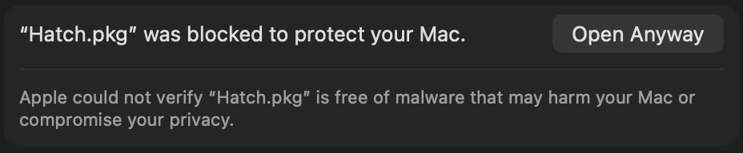
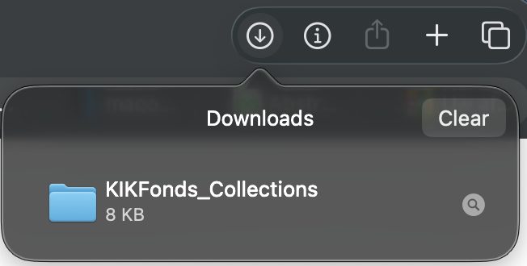

## Hatch – Installatie en Gebruik (Apple Silicon en Intel)

#### Table of Contents
- [Installeren](#installeren)
- [Hatch starten](#hatch-starten)
- [De app gebruiken](#de-app-gebruiken)
- [Tips](#tips)
- [FAQ](#faq)

### Installeren
1. Download `HatchInstaller.pkg` in de releases tab of via deze [link](https://github.com/Tiberon-Kuiper/Hatch/releases/download/1.0.0/HatchInstaller.pkg).
2. Dubbelklik `HatchInstaller.pkg`.
3. Krijg je de melding dat het bestand niet geopend kan worden? Klik **OK** en open **Instellingen → Privacy & beveiliging** (zie afbeelding).

4. Klik bij de waarschuwing op **Open toch** (zie afbeelding).
5. Kies in de installer **Ga door** → **Installeer**.
6. Na afloop vind je Hatch via Spotlight (⌘+spatie, typ “Hatch”) of in `/Applications/Hatch.app` (CLI: `hatch`).

### Hatch starten
- Open Hatch via Spotlight of `/Applications/Hatch.app`. Er verschijnt automatisch een Terminal-venster met Hatch.
- Vraagt macOS of Terminal geopend mag worden? Kies **Open**.

### De app gebruiken
1. Start Hatch.
2. Sleep het gedownloade bestand of de map in het venster en druk **Enter**.
3. Druk nogmaals **Enter** om de standaard IntelliJ IDEA-map te gebruiken (aanbevolen) of pas het pad aan.
4. Wacht tot het programma klaar is. Eventuele meldingen kun je meestal negeren.
5. Klaar? Druk op `O` om de herstelde map direct in IntelliJ IDEA te openen, of sluit het venster.

### Tips
- Geen aanhalingstekens nodig; slepen vanuit Finder werkt het snelst.
- Zie je een foutmelding? Noteer de tekst en probeer opnieuw of deel de melding met de assistent.
- Verwijderen kan door `/usr/local/bin/hatch` en `Applications/Hatch.app` weg te halen.

### FAQ
Q: Ik kan mijn gedownloade bestand niet vinden in Finder.  
A: Apple verbergt het soms extra goed.
1. Klik in je browser op **Downloads** en daarna op het vergrootglas-icoon 

3. Finder opent nu de map met het bestand. Ga verder met de installatiestappen.

Shield: [![CC BY-NC-ND 4.0][cc-by-nc-nd-shield]][cc-by-nc-nd]

This work is licensed under a
[Creative Commons Attribution-NonCommercial-NoDerivs 4.0 International License][cc-by-nc-nd].

[![CC BY-NC-ND 4.0][cc-by-nc-nd-image]][cc-by-nc-nd]

[cc-by-nc-nd]: http://creativecommons.org/licenses/by-nc-nd/4.0/
[cc-by-nc-nd-image]: https://licensebuttons.net/l/by-nc-nd/4.0/88x31.png
[cc-by-nc-nd-shield]: https://img.shields.io/badge/License-CC%20BY--NC--ND%204.0-lightgrey.svg
